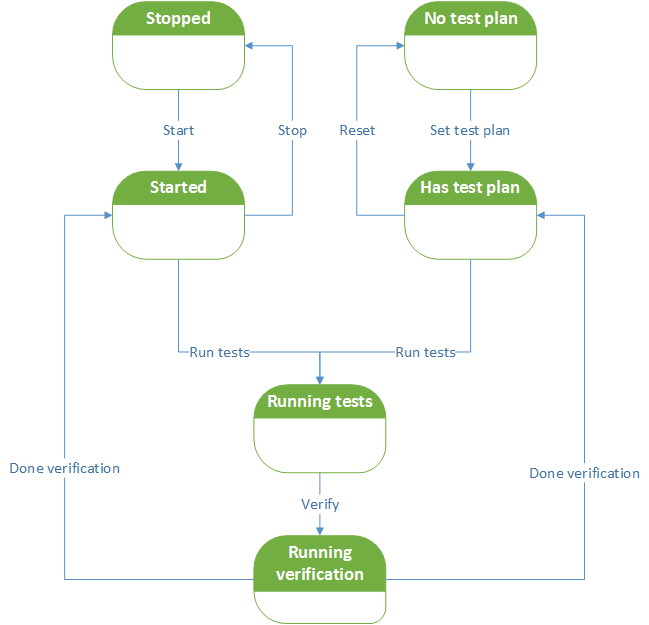

# HTTP Spy

HTTP Spy is a spy tool for unit tests on HTTP clients.

_For definition of test spy and how it differs from mock object, see
[xUnit Patters web page](http://xunitpatterns.com/Mocks,%20Fakes,%20Stubs%20and%20Dummies.html)._

When setting test expectations, you program HTTP Spy what HTTP requests to
expect from your system under test (SUT). For example, you can set up
expectations on the following SUT behavior:

* Total number of requests
* Order of requests
* Request body content
* Request header value
* Request method (POST/GET etc.)

In addition, you may instruct HTTP Spy which response it should send on each
incoming request. After expectations are set, you start HTTP Spy and run your
HTTP system under test. Finally, you instruct HTTP Spy to verify all requests
it received.

HTTP Spy runs on a local network interface. It is possible to configure network
port and HTTP path where HTTP Spy services incoming requests. You can also
specify the number of servicing threads. However, if you configured more than
one servicing thread in HTTP Spy, then you cannot set expectations on request
order.

HTTP Spy provides the following ways to set expectations on body and header
values, as well as on HTTP method and path:

* String is equal to the expected value
* String is equal ignoring case
* String matches by means of [Hamcrest matcher](http://hamcrest.org/)
* XML is identical
* JSON is identical

## Usage

### Linking

First, you need to declare a Maven dependency on HTTP Spy:

    <groupId>com.github.tashoyan</groupId>
    <artifactId>httpspy</artifactId>
    <version>1.1</version>
    <scope>test</scope>

The dependency scope is `test` because normally you use HTTP Spy in unit tests
only.

### HTTP Spy lifecycle

The picture below shows the lifecycle of HTTP Spy.

To start executing your test, you need to

* Start HTTP Spy
* Set a test plan (see below)

You can do these two steps in any order. After HTTP Spy is started and has
a test plan, you can execute your test with actual requests.

As soon as test requests are executed, you switch HTTP Spy to the verification
phase. During verification, HTTP Spy checks actual requests it received against
the request expectations specified by the test plan. In case of a mismatch,
verification fails with an error.

After verification phase, you can reset HTTP Spy and then set a new test plan.
If you are done with your tests, then you have to stop HTTP Spy to clean up
resources it consumes.

Some good practices for usage with [JUnit](http://junit.org):

* Start HTTP Spy in a method annotated as `@Before` or `@BeforeClass`
* Stop HTTP Spy in a method annotated as `@After` or `@AfterClass`
* Verify actual requests in a method annotated as `@After` or in a test method
immediately after all requests are executed

Here is the reference of HTTP Spy methods controlling the lifecycle:

Method  | Description
------- | -----------
start() | Start HTTP Spy
testPlan() | Set a test plan
verify() | Verify actual requests against expectations
reset() | Reset the current test plan in order to set new test plan
stop() | Stop HTTP Spy

### Stub responses for the SUT requests

`StubPlan` is a test plan for HTTP Spy that provides responses based on request
features. It implements [Test Stub](http://xunitpatterns.com/Test%20Stub.html)
object. For example, you can set up HTTP Spy to send a response with body
`Fine` on every request with body `How are you?`. You can specify as many request
expectations as you wish and a desired response for every expectation.

A request unmatched to all specified expectation is recorded. During verification,
HTTP Spy lists all unmatched requests and reports a failure if there are any.

This a multi-threaded test plan, so you can run HTTP Spy with many servicing threads.

Below is an example of `StubPlan` usage.

First, start HTTP Spy instance on `0.0.0.0` network interface, on port number `47604`
and let it service requests on HTTP path `/spyseverpath`. We also want it to serve
requests concurrently in 10 threads.

    HttpSpy httpSpy = CamelJettyHttpSpy("0.0.0.0", 47604, "/spyseverpath");
    httpSpy.setServiceThreadsNumber(10);
    httpSpy.start();

Setup some expectations:

    httpSpy.testPlan(new AbstractStubPlanBuilder() {
        public void compose() {
            expect(request()
                    .withMethod(equalToIgnoreCase("get"))
                    .andResponse(response()
                        .withBody("First")));
            expect(request()
                    .withBody(equalToJson("{\"value1\":\"1\", \"value2\":\"2\"}"))
                    .andResponse(response()
                        .withStatus(500)
                        .withBody("Second")));
            expect(request()
                    .withHeader("h1", matching(containsString("v1")))
                    .andResponse(response()
                        .withBody("Third")
                        .withDelay(TimeUnit.MILLISECONDS, 1000)));
            }
        });

As you may note, it is possible to set various expectations on the body content
or on a header value. It is possible to send responses with various status codes
and with some delay (useful to emulate a slow server).

As soon as HTTP Spy is up and has a test plan, you are ready to run your client
SUT and let it send requests. HTTP Spy will send responses according to expectations
in the test plan. The order of expectation checks is as following: the latest
(most recently added) expectation is checked first.
If HTTP Spy receives a request that does not match any expectation,
then it sends back a response with status code `500 - Internal server error` and the
unmatched request in the body.

After the client finished, you ask HTTP Spy to verify requests it has received:

    ...
    // SUT executes requests...
    ...
    httpSpy.verify();

HTTP Spy will fail the verification step (and the test) if it finds that some
requests did not match any expectation specified in the test plan.

If you don't need HTTP Spy anymore, then you need to stop it to free up
resources it consumes:

    httpSpy.stop();

Alternatively, you can reset HTTP Spy expectations and continue using the same
instance, though with new test plan, in the next test:

    httpSpy.reset();

### Checking request order

`SequencePlan` is a special test plan for HTTP Spy to allow checking requests order.
The important thing to know about this test plan is that it is not multi-threaded.
You cannot use `SequencePlan` when you have multiple servicing threads in HTTP Spy.
The reason is that there is no order guarantee when the server processes requests
in multiple threads.

With this test plan, HTTP Spy expects requests from SUT and sends responses back
exactly in the order specified with expectations. During verification
phase, HTTP Spy checks that the number of actual requests is equal to the number
of expectations, and each actual request matches its corresponding expectation.
If the number differs or a request does not match, then the verification fails
(and so the test).

Below is an example of `SequencePlan` usage.

First, start HTTP Spy instance on `0.0.0.0` network interface, on port number `47604`
and let it service requests on HTTP path `/spyseverpath`. Here we do not specify
the number of servicing threads; only default value `1` is valid.

    HttpSpy httpSpy = CamelJettyHttpSpy("0.0.0.0", 47604, "/spyseverpath");
    httpSpy.start();

Setup some expectations:

    httpSpy.testPlan(new AbstractSequencePlanBuilder() {
        public void compose() {
            expect(request()
                .withStrictHeaders()
                .withBody(matching(both(containsString("Hello"))
                                    .and(containsString("world"))))
                .withHeader("header", matching(endsWith("111")))
                .andResponse(response()
                    .withStatus(200)
                    .withBody("OK")));
            expect(request()
                .withMethod(equalToIgnoreCase("get"))
            expect(request()
                .withBody(equalToXml("<xml><color>red</color></xml>"))
                .andResponse(response()
                    .withStatus(500)));
            }
        });

Here HTTP Spy expects three requests exactly in the sequence specified by the
test plan. The rest of usage is the same as for `StubPlan`.

### Usage examples

For usage examples, see unit tests:

* `SequenceTest`: various scenarios with `SequencePlan`
* `StubSimpleTest`: single-threaded scenarios with `StubPlan`
* `BodyExpectationsTest`: various examples on setting request body expectations
* `HeaderExpectationsTest`: various examples on setting request headers expectations
* `StubConcurrentTest`: multi-threaded scenarios with `StubPlan`

## Additional documentation

For configuration options, see Javadoc of methods in `HttpSpy` interface.

For different options to set request expectations, see Javadoc of methods in
`AbstractTestPlanBuilder` class and its subclasses.

For response options, see Javadoc of methods in `ResponseBuilder` interface.

## Implementation details

This version of HTTP Spy is implemented with [Camel Jetty](http://camel.apache.org/jetty.html).

HTTP Spy uses [XMLUnit](http://www.xmlunit.org/) for XML matching and
[JSONassert](https://github.com/skyscreamer/JSONassert) for JSON matching.

For object matching, HTTP Spy heavily relies on [Hamcrest matcher](http://hamcrest.org/).

Unit tests for HTTP Spy generate HTTP requests and check HTTP responses with
great help of [REST-assured](http://rest-assured.io/).

## License

HTTP Spy is licensed under Apache 2.0 license.
